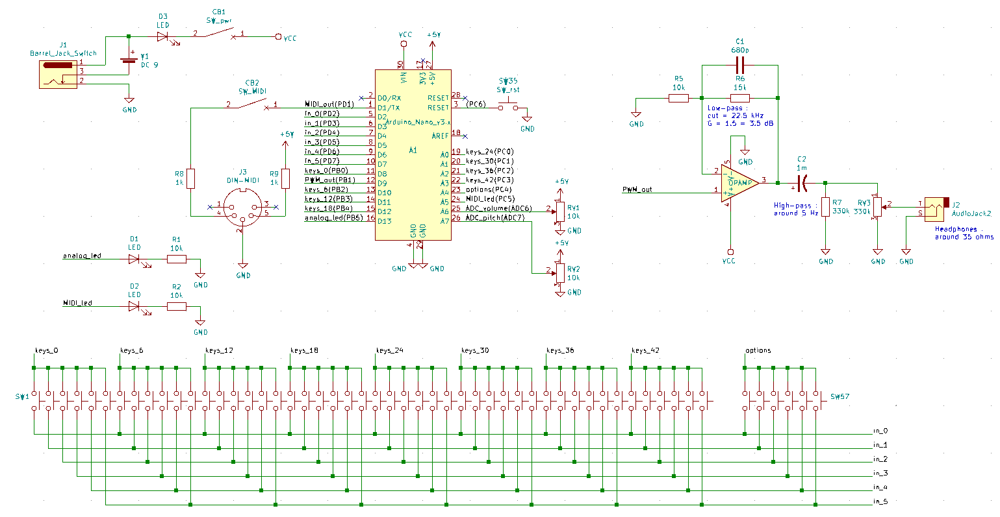

# MIDI & Analog Arduino Keyboard

## Description

The goal of this project is to create the software associated with a musical keyboard. This keyboard will be able to output MIDI data using UART protocol, and will also be able to output analog signal for earphones or speakers through a band-pass filter. A proposition for this filter is available below.

This software is meant to be downloaded on an ATMega328p chip. This chip is the one used on Arduino Nano boards. The provided code is not meant to be portable and is highly related to the architecture of the ATMega chip. This is due to high constraints on computation time for analog data. This constraints may not have been met with a high-level library such as the ones provided by the Arduino IDE.

The provided code features a lot of comments in order to ease the comprehension. In the case one might have questions on how to use or modify it, feel free to contact me.

## How can I modify the code to fit my needs ?

The provided code features a lot of preprocessor commands and macros meant to adapt the software to your needs. Indeed you can modify :
- The number of keys `KEYS_NUMBER`, default is 36
- What your first key is with `FIRST_KEY`, default is 0 for C
- At which note you want your keyboard to boot with `DEFAULT_PITCH_0_OFFSET`, default is 36 for C3
- If you want a pitch wheel, define `ENABLE_VIBRATO`, defined by default
- If you want a volume wheel, define `ENABLE_TREMOLO`, defined by default

## How do I use it ?

At boot, the chip will turn on both the MIDI and Analog LEDs, meaning that it it waiting for you to select the mode you wish to use. Press the first key of your keyboard to use analog mode, or the second one to use the MIDI mode. Reset the chip to return to select another mode. That's it !

You can tune your keyboard an octave up or down by pressing the first or second settings button. Alternatively, it is also possible to tune it a semitone up or down by pressing the third or fourth settings button. Press the fifth settings button in order to reset your pitch. In Analog mode, the sixth settings button is used to switch between three available wave shapes : Square, Triangle, and Saw.

Enjoy !

## What does the code do ?

Using the ATMega328p datasheet may be useful in order to fully understand the provided code. It is available [here](http://ww1.microchip.com/downloads/en/DeviceDoc/Atmel-7810-Automotive-Microcontrollers-ATmega328P_Datasheet.pdf).

### Handling the keys

Due to the number of keys meant to be connected to the chip, it was not possible to connect an unique key per pin. To solve this problem, the provided code does not continuously scan all keys state and use a button matrix. Doing so, it scans all keys state by groups of six very fast (on inputs PD2 to PD7), so that it is unnoticeable by a human being. A group is scanned by setting an output such as `keys_0` on PB0 to ground. The inputs being pull-up, any pressed key will result in a logical `1` instead of `0` on the other inputs.

### Analog mode

The analog mode aims at creating analog audio data, using the timer 1 of the ATMega to handle time measurement and PWM output. According to the ATMega documentation, the pin PB1 is internally connected to the PWM output of the Timer 1.

When the timer hits its auto-reload value, that defines the sampling rate, the software uses all keys state to compute the level of the selected wave shape. this number then defines the PWM ratio, indeed the value of the analog output for this sample.

The ADC is used to know the value of the pitch and volume wheels. The pitch wheel shortens or lengthen the period of each note, and the volume one modifies its amplitude. When both wheels are enabled, the ADC switches what wheel to scan each time it finishes a conversion.

### MIDI mode

The MIDI mode does not need time measurement ans simply scans continuously the state of the keyboard in order to output MIDI messages on the UART port.

The ADC is still used to compute the value of the pitch and volume wheels. A corresponding MIDI message is sent each time the ADC conversion is complete and the value for the selected wheel has changed.

## Full schematics

Here is a proposition of the full circuit, including :
- an Arduino Nano board, including the ATMega328p
- the Keyboard itself, a simple array of buttons
- two potentiometers, the volume and pitch wheels
- a MIDI connector
- two LEDs indicating which mode is active, MIDI or analog
- a power jack, power switch and power LED
- a band-pass filter
- an output audio jack for analog mode

This circuit features a MIDI switch in order to deactivate the MIDI connector in order to use the USB port integrated on a common Arduino Nano Board, which is linked to the UART module.

This circuit has been created using the free software Kicad, the source files are available in the repository under `Kicad_files/`.

## Credits

*Brice Croix, 2020*
https://github.com/BriceCroix/
